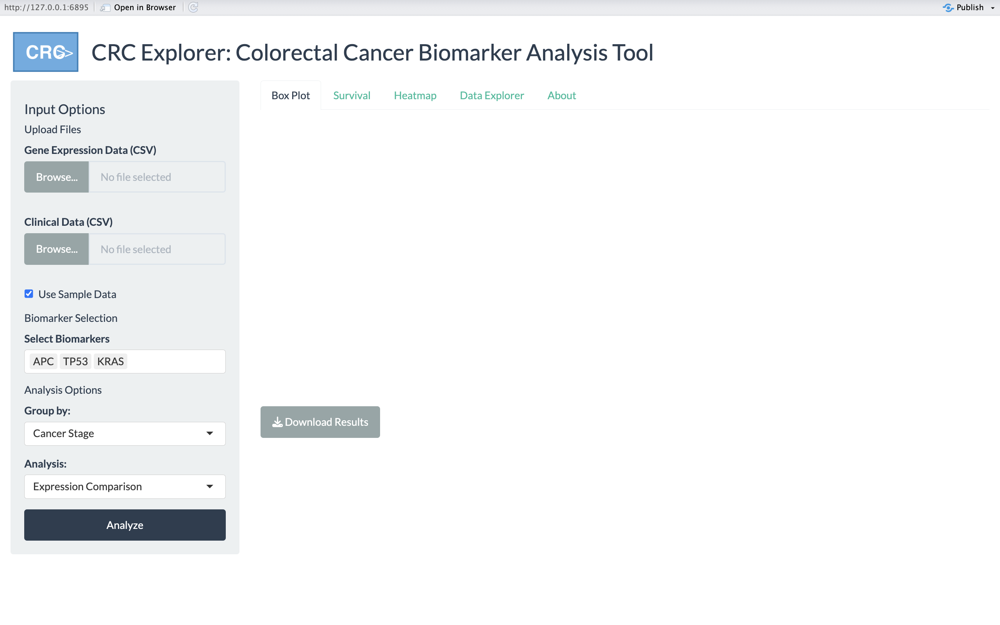

# CRC Explorer

## Interactive Tool for Colorectal Cancer Biomarker Analysis

CRC Explorer is an interactive web-based tool designed to analyze gene expression patterns of colorectal cancer biomarkers across different patient cohorts. Built using R Shiny, it enables researchers to visualize biomarker expression patterns, perform survival analyses, and identify correlations between multiple biomarkers in an intuitive interface.



## Key Features

- **User-Friendly Interface**: Designed for clinical researchers with minimal bioinformatics expertise
- **Multi-Biomarker Analysis**: Compare expression of multiple biomarkers (APC, TP53, KRAS, MLH1, BRAF, PIK3CA) across patient subgroups
- **Statistical Analysis**: Automatically calculates ANOVA and p-values for biomarker comparisons
- **Survival Analysis**: Evaluate prognostic value of biomarkers with Kaplan-Meier curves and Cox proportional hazards models
- **Interactive Visualizations**: Explore data through interactive box plots and heatmaps
- **Ready-to-Use Sample Data**: Includes synthetic dataset of 100 CRC patients

## Installation & Running

### Prerequisites
- R (version 4.0.0 or higher)
- Required R packages:
  ```r
  install.packages(c("shiny", "shinythemes", "DT", "ggplot2", "tidyr", 
                  "dplyr", "plotly", "survival", "survminer", 
                  "heatmaply", "RColorBrewer"))
  ```

### Running the App
Option 1: Run directly from GitHub:
```r
shiny::runGitHub("CRC-Explorer", "sepehrmaleki369")
```

Option 2: Clone and run locally:
```r
# Clone repository
git clone https://github.com/sepehrmaleki369/CRC-Explorer.git

# Run app
setwd("CRC-Explorer")
shiny::runApp()
```

## Using CRC Explorer

1. **Data Input**:
   - Use the provided sample data by checking "Use Sample Data"
   - Or upload your own gene expression and clinical data files (CSV format)

2. **Biomarker Selection**:
   - Select biomarkers of interest from the dropdown menu
   - Multiple selections are supported for comparison

3. **Analysis Options**:
   - Group by: Cancer Stage, Treatment Response, or Survival Status
   - Analysis type: Expression Comparison, Survival Analysis, or Correlation Analysis

4. **Visualization**:
   - Box Plot: Compare biomarker expression across patient subgroups
   - Survival: Analyze survival outcomes based on biomarker expression
   - Heatmap: Visualize correlations between biomarkers
   - Data Explorer: Interactive table view of the dataset

5. **Export Results**:
   - Download plots and data for further analysis or publication

## Sample Data Description

The synthetic dataset includes:
- **Gene expression data** for 100 patients across 6 common CRC biomarkers
- **Clinical data** including cancer stage, treatment response, survival status, and demographic variables
- **Realistic patterns**: TP53 expression increases with cancer stage; KRAS expression correlates with poorer survival

## Technical Details

CRC Explorer includes innovative features not typically covered in standard R courses:
- Interactive heatmaps using the `heatmaply` package for exploring complex biomarker correlations
- Reactive programming model for seamless updates based on user selections
- Integrated statistical analysis with visualization

## Author

Sepehr Maleki  
sepehr.maleki@bilkent.edu.tr  
Bilkent University, Turkey

